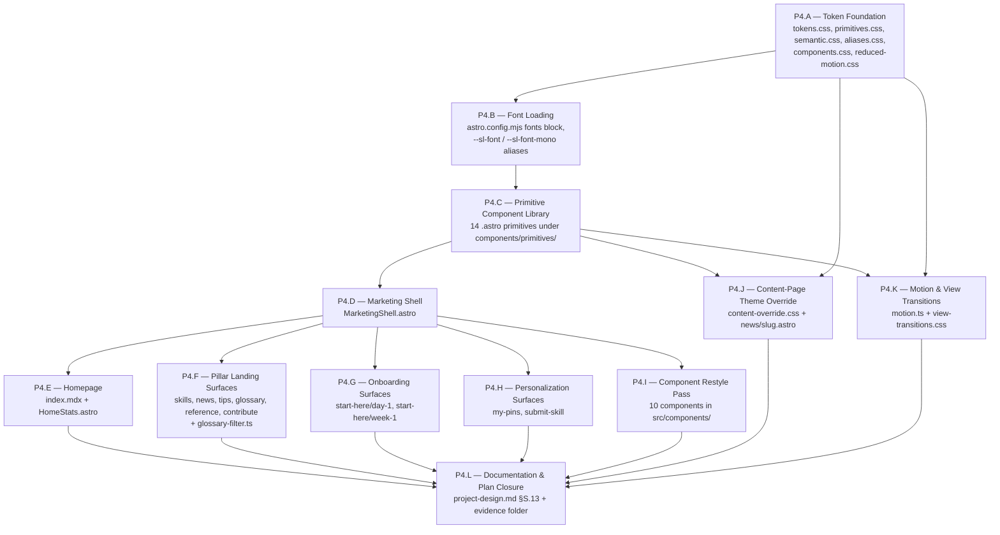

# Plan 004 — UI Redesign (Sleek, Captivating, Linear/Vercel/Stripe-Influenced)

**Refined request:** `docs/refined-requests/ui-redesign.md`
**Codebase scan:** `docs/reference/codebase-scan-ui-redesign.md`
**Investigation (Phase 3a):** `docs/reference/investigation-ui-redesign.md`
**Research (Phase 3b):**
- `docs/research/astro-fonts-api-experimental-stability.md`
- `docs/research/pagefind-ui-variant-in-starlight-0-39.md`
**Design section to be added:** `docs/design/project-design.md` §S.13 "Design system" (delivered in Phase P4.L of this plan)
**Created:** 2026-05-19
**Status:** Draft — Phase 4 output, awaiting Phase 5 design contracts

This plan sequences the implementation of the NbgAiHub UI redesign inside the user-locked Option 1 hybrid (keep Starlight + bespoke marketing surfaces via splash template + theme override on content pages). The aesthetic anchor is Linear / Vercel / Stripe — Apple-influenced, dark-mode-first, monospace accents, expressive typography, motion-on-scroll. The plan owns *sequencing, dependencies, files to modify, parallelization seams, and verification criteria per step*. Architecture decisions (token taxonomy specifics, component prop contracts, primitive interfaces, error-handling shape) are deferred to Phase 5 (Designer) — `project-design.md` §S.13.

The escalation gate to Option 2 (replace Starlight) sits after Phase 6 evaluation. The plan keeps tokens, primitives, and content-collection wiring portable so an Option 2 escalation rewrites only `MarketingShell.astro` + the `--sl-*` alias block + `SocialIconsOverride.astro` (~400 LOC of ~1500 total — about 73% of the work survives).

---

## Goal statement

Replace the current Starlight-default look with a bespoke, dark-mode-first, editorial visual system. Build a three-tier design-token layer (primitives → semantic → component) as CSS custom properties, layer Astro Fonts API typography (Inter Variable + JetBrains Mono Variable) on top, hand-roll ~13 portable primitive components, wrap all 11 marketing surfaces in one shared `MarketingShell.astro`, give each surface a distinct editorial composition (no centered hero, no uniform `repeat(auto-fill, minmax(18rem, 1fr))` grid, no flat audience-badge colors), and deep-theme the Starlight-chrome content-detail pages via `--sl-*` token re-mapping. Preserve every behavior contract: 8 `lib/` modules unchanged, the 127-test floor unchanged, Pagefind functional, the 11-entry sidebar unchanged, AudienceFilter persistence + PinButton + SignInModal + submit-skill validation all unchanged. Ship documentation (project-design.md §S.13) so the work is intelligible to the next engineer and survives an Option 2 escalation.

---

## 1. Refinement reconciliations

Pre-implementation reconciliations the plan must respect. Each below is either already applied in the refined request / investigation / research, or must be applied by the implementer at the phase indicated.

- **R-1 — Astro Fonts API is stable, not experimental.** Phase 3b research (`astro-fonts-api-experimental-stability.md`) verified `fonts: [...]` is a top-level `defineConfig` field in Astro 6.3.5, annotated `@version 6.0.0`, with eight built-in providers (we use `fontProviders.fontsource()`). The refined request's open question about wiring the Fonts API is resolved: use it directly. The exact `astro.config.mjs` block is in the research doc (§"Recommended astro.config.mjs"). **Applied at P4.B.**

- **R-2 — Pagefind UI variant is the legacy Default UI, override path is `--sl-color-*` aliases.** Phase 3b research (`pagefind-ui-variant-in-starlight-0-39.md`) found Starlight 0.39.2 bundles `@pagefind/default-ui@^1.3.0` (NOT the modern Component UI). The investigator's Axis 5 advice ("alias `--pf-*`") was off by one layer: Starlight's `Search.astro` already aliases `--sl-color-*` tokens into `--pagefind-ui-*` in its own `<style is:global>` block. **Our `tokens.css` overrides Starlight's `--sl-color-*` tokens and Pagefind retints automatically. We do NOT write `--pagefind-ui-*` overrides.** The exact 16-entry `--sl-color-*` alias map is in the research doc. **Applied at P4.A.**

- **R-3 — Three-tier token architecture, not two.** Investigation Axis 1 ratified primitives → semantic → component. Phase 4 splits `tokens.css` into an aggregator + tier files (`tokens/primitives.css`, `tokens/semantic.css`, `tokens/aliases.css`). The aggregator declares `@layer reset, tokens, base, components, utilities;` and the `--sl-*` alias block lives in `tokens/aliases.css` inside `@layer tokens { ... }`. **Applied at P4.A.**

- **R-4 — Primitives live in a sub-folder, not at top-level `components/`.** Investigation Axis 6 recommended `site/src/components/primitives/` so primitives are conceptually separated from the existing 10 components (which become *consumers* of primitives). This also makes the AC36 portability grep trivial: `grep -r '@astrojs/starlight' site/src/components/primitives/` must return zero hits. **Applied at P4.C.**

- **R-5 — MarketingShell is THE Starlight isolation boundary.** Investigation Axis 2D ratified one shared `MarketingShell.astro` (~80 LOC) wrapping every marketing page's content. Each page becomes a ~30-line consumer. The shell is the only file outside the `--sl-*` alias block that imports from `@astrojs/starlight/*` (specifically `StarlightPage` via `@astrojs/starlight/components/StarlightPage.astro` — the documented public override path). If we escalate to Option 2 post-Phase-6, this is the single file we rewrite. **Applied at P4.D.**

- **R-6 — `template: splash` requires `frontmatter` on `<StarlightPage>`.** All 11 marketing pages currently use `<StarlightPage frontmatter={{ title }}>`; the redesign passes `frontmatter={{ template: 'splash', title, description }}` inside `MarketingShell.astro` so callers don't repeat the boilerplate. Splash drops sidebar/TOC; the header (with search trigger + theme toggle + sign-in chip via `SocialIconsOverride`) remains, which is exactly what AC31/AC32/AC33 require. **Applied at P4.D.**

- **R-7 — `custom.css` is absorbed, not retained alongside.** Refined request Q5 default is "absorb into `tokens.css` + new `components.css`, delete standalone after migration." The 133-line legacy file's selectors (`.home-hero`, `.news-card-grid`, `.audience-badge`, `.audience-hidden`, etc.) are either (a) absorbed into primitives' scoped styles, (b) re-expressed as tokenized component rules in `site/src/styles/components.css`, or (c) deleted because the new editorial layouts replace them. **Exception:** `.audience-hidden { display: none !important; }` is preserved verbatim in `tokens/utilities.css` (or `components.css`) because `AudienceFilter.astro`'s script toggles this class and AC35 forbids behavior change. **Applied at P4.A + P4.I.**

- **R-8 — Day-1 journey is a marketing surface (per A5).** AC6 wants a bespoke chapter/step layout with anchor `#step-N`s, sticky desktop indicator, accordion-or-equivalent mobile. The current `site/src/pages/start-here/day-1.astro` renders the journey collection entry's prose. The redesign needs a small new primitive (`StepIndicator.astro`) plus markup discipline (each step wrapped in `<section id="step-N">`). The journey content (`journeys/day-1.md`) is content-edit out-of-scope per refined spec — the redesign supplies the layout, not new step text. **Applied at P4.G.**

- **R-9 — `[data-theme='dark']` and `:root[data-theme='light']` are both required.** Investigation Axis 7 + the research doc converge: tokens must be scoped under both attribute selectors so Pagefind retints on toggle. Defining tokens only under `:root` (unscoped) breaks theme switching. AC24 (dark default) is delivered by Starlight's existing inline `<head>` ThemeProvider script — we do not touch it. **Applied at P4.A.**

- **R-10 — `npm run check` and `npm run build` chains stay.** Existing scripts (per plan-002 R-3) are `"check": "astro sync && astro check"` and `"build": "tsx scripts/build-pin-index.ts && astro check && astro build"`. The redesign does not modify either. AC29 verification calls them as-is. **Applied at P4.L verification only.**

- **R-11 — Tests assert behavior, not DOM structure (mostly).** Phase 2 scan + Phase 3a §"Test rewriting cost" confirmed: 104 of 127 tests are pure unit tests of `lib/` modules. The ~23 remaining (PinButton's pressed-state, SignInModal's open-event, my-pins integration, build-pin-index integration) target behavior. Updating class-name assertions if they appear is a ≤5-test surface. **Budget: zero deletions. Replacement assertions preserve coverage intent. Verification at P4.I and P4.L.**

- **R-12 — No new runtime dependencies.** Investigation aggregate scorecard: 0 new runtime deps, ~50 LOC of new client-side JS (motion observer + glossary filter). Astro Fonts API is build-time only. JetBrains Mono and Inter are fetched at build time by the Fontsource provider, cached in `node_modules/.astro/fonts/`, emitted as hashed `.woff2` to `dist/_astro/`. No `npm install` lines other than verifying current deps. **Verified at P4.L (`npm ls` review).**

---

## 2. Phased breakdown

The redesign is split into 12 phases (P4.A through P4.L). P4.A and P4.B run sequentially first (everything else depends on tokens + fonts). P4.C builds the primitive library that P4.D consumes. P4.D produces `MarketingShell.astro` which P4.E–P4.K all consume. P4.E–P4.K own disjoint files and run in parallel. P4.L closes documentation.

Each phase entry below has: **inputs** (files read), **outputs** (files created/modified), **dependencies** (which prior phases must complete), **parallelization seam** (which sibling phases CAN run in parallel), **verification criteria** (concrete commands/assertions a verifier can run).

---

### P4.A — Token Foundation

**Goal:** Stand up the three-tier design-token layer (primitives → semantic → component) as CSS custom properties under `@layer tokens`, including the `--sl-color-*` alias block that retints Pagefind and Starlight chrome.

**Inputs (files read):**
- `docs/refined-requests/ui-redesign.md` (R1, AC1–AC4, A12, A7)
- `docs/reference/investigation-ui-redesign.md` (Axis 1, Axis 7, "Implementation Considerations")
- `docs/research/pagefind-ui-variant-in-starlight-0-39.md` (`--sl-color-*` alias map, lines 99–138)
- `site/src/styles/custom.css` (current 133-line file — extract semantic intent before replacing)
- `site/astro.config.mjs` (current `customCss` array)

**Outputs (files created):**
- `site/src/styles/tokens.css` — aggregator. Declares `@layer reset, tokens, base, components, utilities;`. `@import url('./tokens/primitives.css') layer(tokens);` (and one for semantic + aliases). Top of file documents the layer order rationale.
- `site/src/styles/tokens/primitives.css` — **Tier 1**: raw values. Scoped under `:root`. Color primitives (`--color-slate-50`..`--color-slate-950`, accent ramp, audience hues, confidence hues, success/warning/danger ramps). Spacing (`--space-0` through `--space-9`, 8pt-based). Radii (`--radius-sm`, `--radius-md`, `--radius-lg`, `--radius-pill`). Elevation shadows (`--shadow-1`..`--shadow-4` + `--shadow-focus`). Typography sizes (`--size-caption` through `--size-display`, 8 steps). Weights, line-heights, letter-spacings. Motion (`--duration-fast`, `--duration-base`, `--duration-slow`; `--ease-standard`, `--ease-accelerate`, `--ease-decelerate`, `--ease-spring`). Z-index (`--z-base`, `--z-sticky`, `--z-overlay`, `--z-modal`, `--z-toast`). Breakpoint custom-media tokens (`--bp-mobile`, `--bp-tablet`, `--bp-desktop`).
- `site/src/styles/tokens/semantic.css` — **Tier 2**: meaning, not value. Scoped under `:root, :root[data-theme='dark']` for dark defaults; `:root[data-theme='light']` for light overrides. Surface tokens (`--nbg-color-bg-canvas`, `--nbg-color-bg-surface`, `--nbg-color-bg-elevated`, plus 3 more steps to hit AC1's "≥6 background steps"). Text tokens (`--nbg-color-fg-primary`, `--nbg-color-fg-secondary`, `--nbg-color-fg-muted`, `--nbg-color-fg-inverse`). Accent tokens (`--nbg-color-accent`, `--nbg-color-accent-high`, `--nbg-color-accent-low`). Audience semantic colors (`--nbg-audience-beginner-bg`, `--nbg-audience-beginner-fg`, mirrored for `advanced` and `both`). Confidence semantic colors (low/medium/high). Status colors (success/warning/danger). Focus ring (`--nbg-focus-ring`).
- `site/src/styles/tokens/aliases.css` — **Tier 3**: cross-system aliases. Aliases the new tokens onto Starlight's `--sl-color-*` surface (the 16-entry map from the Pagefind research doc) so Starlight chrome + Pagefind retint without touching internals. Also aliases `--sl-font` and `--sl-font-mono` to the new font tokens (placeholder values until P4.B lands). Scoped under both `:root, :root[data-theme='dark']` and `:root[data-theme='light']`.
- `site/src/styles/components.css` — semi-aggregator for absorbed `custom.css` rules that don't belong in tokens. Houses `.audience-hidden { display: none !important; }` verbatim (per R-7 exception). Other class-based rules from legacy `custom.css` either (a) get absorbed into primitive scoped styles in P4.C, (b) get re-expressed here as tokenized component rules, or (c) are deleted because the new layout replaces them. P4.A drops `.audience-hidden` here; the rest is filled in during P4.I.
- `site/src/styles/reduced-motion.css` — single `@media (prefers-reduced-motion: reduce) { :root { --duration-fast: 0.01ms; --duration-base: 0.01ms; --duration-slow: 0.01ms; } }` block. AC22 backbone.

**Outputs (files modified):**
- `site/astro.config.mjs` — replace `customCss: ['./src/styles/custom.css']` with `customCss: ['./src/styles/tokens.css', './src/styles/components.css', './src/styles/reduced-motion.css']`. Order matters: tokens first so layer is declared before any `@layer tokens { ... }` rule fires elsewhere.

**Outputs (files deleted):**
- `site/src/styles/custom.css` — replaced by tokens.css + components.css aggregate. **Delete after components.css is verified non-empty** (verify by `wc -l site/src/styles/components.css` ≥ 1 line). If anything was missed, P4.I will catch it.

**Dependencies:** None. P4.A is the first phase.

**Parallelization seam:** Sequential gate. Nothing downstream can start until P4.A's outputs exist. P4.B (fonts) is the only sibling that could *theoretically* run before P4.A finishes, but the alias block in `tokens/aliases.css` references `--nbg-font-body` / `--nbg-font-mono` so P4.B writing those CSS variables strictly after P4.A makes the alias block's references resolve cleanly. **Order P4.A → P4.B.**

**Verification criteria:**
- `ls site/src/styles/tokens.css site/src/styles/tokens/primitives.css site/src/styles/tokens/semantic.css site/src/styles/tokens/aliases.css site/src/styles/components.css site/src/styles/reduced-motion.css` — all six files exist.
- `! ls site/src/styles/custom.css 2>/dev/null` — legacy file is gone.
- `grep -c '^\s*--' site/src/styles/tokens/primitives.css` returns ≥ 40 (covers color, spacing, radii, shadow, type, weight, motion, z-index primitives — the bulk of AC1).
- `grep -c '^\s*--' site/src/styles/tokens/semantic.css` returns ≥ 20 (covers semantic surface/text/accent/audience/confidence/status/focus).
- Combined `grep -c '^\s*--' site/src/styles/tokens/*.css` returns ≥ 60 (AC1 floor).
- `grep "@layer reset, tokens, base, components, utilities" site/src/styles/tokens.css` returns 1 match.
- `grep -E "--sl-color-(black|white|gray-[1-6]|text|text-accent|text-invert|accent|accent-high|accent-low|backdrop-overlay)" site/src/styles/tokens/aliases.css` returns ≥ 13 matches (covers the alias map needed for Pagefind retinting per research doc).
- `grep "audience-hidden" site/src/styles/components.css` matches `display: none !important;` (AC35 preservation).
- `grep "prefers-reduced-motion: reduce" site/src/styles/reduced-motion.css` returns 1 match.
- `grep "':root\[data-theme=.light.\]'" site/src/styles/tokens/semantic.css` matches at least once (AC3: light override block present).
- `grep "':root\[data-theme=.light.\]'" site/src/styles/tokens/aliases.css` matches at least once (R-9, Pagefind-research §"Dark/light mode behaviour").
- `cd site && npm run build` exits 0 (the new CSS layer compiles and Starlight's chrome continues to render — sanity gate before downstream phases).
- `cd site && npm test` reports ≥ 127 passing (no test changes yet; this just confirms the new CSS hasn't broken anything imported into tests, which is none).

---

### P4.B — Font Loading

**Goal:** Wire Astro Fonts API to self-host Inter Variable + JetBrains Mono Variable via the `fontsource` provider, with `latin` + `latin-ext` subsets, optimized metric-matched fallbacks, and CSS variables (`--nbg-font-body`, `--nbg-font-mono`) that the alias block in `tokens/aliases.css` already references.

**Inputs (files read):**
- `docs/research/astro-fonts-api-experimental-stability.md` (entire file — the exact `astro.config.mjs` block is in §"Recommended astro.config.mjs")
- `docs/refined-requests/ui-redesign.md` (R6, AC1 typography tokens, Q1 default)
- `site/astro.config.mjs` (current state)
- `site/src/styles/tokens/aliases.css` (P4.A output — to wire `--sl-font` aliases)

**Outputs (files modified):**
- `site/astro.config.mjs` — add `import { defineConfig, fontProviders } from 'astro/config';` (replacing the existing `defineConfig` import) and add the `fonts: [...]` array to the `defineConfig({...})` block, parallel to `server` and `integrations`. The exact array shape is dictated by the research doc (two entries: Inter and JetBrains Mono, each with `provider: fontProviders.fontsource()`, `cssVariable`, `weights: ['100 900']`, `styles: ['normal', 'italic']`, `subsets: ['latin', 'latin-ext']`, `display: 'swap'`, `optimizedFallbacks: true`, full fallback stack).
- `site/src/styles/tokens/aliases.css` — add `--sl-font: var(--nbg-font-body); --sl-font-mono: var(--nbg-font-mono);` to the `:root` block (so Starlight chrome inherits the new fonts). The `--nbg-font-display: var(--nbg-font-body);` alias goes in `tokens/semantic.css` because it's a semantic alias (display = body family, different opsz), not a Starlight cross-system alias.
- `site/src/styles/tokens/semantic.css` — add `--nbg-font-display: var(--nbg-font-body);` (already specified by P4.A's primitive tier; just confirm it's wired).

**Outputs (files created):** None.

**Dependencies:** P4.A (the alias and semantic tier files exist).

**Parallelization seam:** Sequential after P4.A. P4.C (primitives) cannot start until both P4.A and P4.B are done because primitives reference `--nbg-font-body` / `--nbg-font-mono` / `--nbg-font-display` in their scoped `<style>` blocks.

**Verification criteria:**
- `grep "import { defineConfig, fontProviders } from 'astro/config'" site/astro.config.mjs` matches.
- `grep -E "provider: fontProviders.fontsource\\(\\)" site/astro.config.mjs` returns 2 matches (one per font).
- `grep -E "name: 'Inter'" site/astro.config.mjs` matches.
- `grep -E "name: 'JetBrains Mono'" site/astro.config.mjs` matches.
- `grep -E "subsets: \\['latin', 'latin-ext'\\]" site/astro.config.mjs` returns 2 matches.
- `grep "cssVariable: '--nbg-font-body'" site/astro.config.mjs` matches.
- `grep "cssVariable: '--nbg-font-mono'" site/astro.config.mjs` matches.
- `grep -E "\\-\\-sl-font: var\\(--nbg-font-body\\)" site/src/styles/tokens/aliases.css` matches.
- `cd site && npm run build` exits 0. **First-run note:** the Fontsource provider downloads `.woff2` files from `api.fontsource.org` on first build; subsequent builds use the cache at `node_modules/.astro/fonts/`. CI is connected, so this is non-blocking.
- After build: `ls site/dist/_astro/*.woff2` returns 2 (or more, if Fontsource emits per-style files) — actual file count depends on what Astro emits for the requested subsets. Confirm at least 2 woff2 emitted.
- After build: `grep -E "@font-face|font-family: 'Inter'" site/dist/index.html` matches (Astro's injected `<style>` block in `<head>`). This verifies the API ran.
- `cd site && npm test` reports ≥ 127 passing.

---

### P4.C — Primitive Component Library

**Goal:** Hand-roll the ~13 portable primitive components per investigation Axis 6. Each primitive lives under `site/src/components/primitives/`, imports nothing from `@astrojs/starlight/*`, and consumes only design tokens. Primitives are the visual vocabulary for P4.D through P4.K.

**Inputs (files read):**
- `docs/reference/investigation-ui-redesign.md` (Axis 6 — the 13-primitive table)
- `docs/refined-requests/ui-redesign.md` (R4, R6, R7, R8 — the styling/accessibility/responsive contracts each primitive must satisfy)
- `site/src/styles/tokens/*` (P4.A output — token names primitives reference)
- `site/astro.config.mjs` (P4.B output — confirm font CSS variables are wired)

**Outputs (files created):** A new folder `site/src/components/primitives/` containing 13 `.astro` files plus 1 utility script (motion observer lands in P4.K but `MotionReveal.astro` lands here):
- `site/src/components/primitives/Container.astro` — width-capped wrapper with side padding; props: `width?: 'narrow' | 'default' | 'wide' | 'full'`.
- `site/src/components/primitives/Section.astro` — full-bleed section with vertical rhythm tokens, optional gradient wash; props: `tone?: 'default' | 'subtle' | 'inverse'`, `paddingBlock?: 'sm' | 'md' | 'lg'`.
- `site/src/components/primitives/Stack.astro` — vertical-flex layout; props: `gap?: '0' | '1' | ... | '9'` (token names), `align?`, `as?: 'div' | 'section' | 'article'`.
- `site/src/components/primitives/Cluster.astro` — horizontal flex layout for chip rows, CTA rows; props mirror Stack.
- `site/src/components/primitives/Card.astro` — generic card with variants; props: `variant?: 'feature' | 'content' | 'link' | 'stat'`, `as?: 'article' | 'div' | 'a'`, `href?` (when `as='a'`).
- `site/src/components/primitives/Button.astro` — accessible `<button>` or `<a>` element; props: `variant?: 'primary' | 'secondary' | 'ghost'`, `size?: 'sm' | 'md' | 'lg'`, `as?: 'button' | 'a'`, `href?`, `type?`. ARIA-clean by default.
- `site/src/components/primitives/Badge.astro` — semantic colored pill; props: `tone?: 'beginner' | 'advanced' | 'both' | 'high' | 'medium' | 'low' | 'success' | 'warning' | 'danger' | 'neutral'`. **This is what `AudienceBadge.astro` and `ConfidenceChip.astro` will internally compose at P4.I.**
- `site/src/components/primitives/Chip.astro` — tag chip (replaces legacy `.topic-chip`); props: `interactive?: boolean`, `href?`.
- `site/src/components/primitives/Kbd.astro` — `<kbd>` element with mono font + 1px border; props: none (children only).
- `site/src/components/primitives/Eyebrow.astro` — pre-heading label (mono, uppercase, tracked); props: `as?: 'p' | 'span' | 'div'`.
- `site/src/components/primitives/Lede.astro` — first-paragraph display treatment (light weight, expressive size, tightened line-height); props: `as?: 'p' | 'div'`.
- `site/src/components/primitives/Display.astro` — display heading wrapping `<h1>` through `<h4>` with optical-size tightening (`font-variation-settings: 'opsz' 32` for h1; smaller `opsz` for h2/h3); props: `level: 1 | 2 | 3 | 4`, `size?: 'sm' | 'md' | 'lg' | 'xl'`.
- `site/src/components/primitives/MotionReveal.astro` — wrapper that adds `data-reveal="true"` to its root element; the IntersectionObserver script in P4.K reads these and toggles a `.is-revealed` class. Props: `as?`, `delay?: number` (ms).
- `site/src/components/primitives/StepIndicator.astro` — vertical or sticky step indicator for Day-1 journey (and any future stepped surface); props: `steps: Array<{ id: string; label: string }>`, `current?: string`, `sticky?: boolean`.

Each component has a header comment block per R12.2: purpose, related design section (`§S.13.x`, to be confirmed in P4.L), key contract.

**Outputs (files modified):** None. Primitives are net-new.

**Dependencies:** P4.A, P4.B.

**Parallelization seam:** Internal parallelization possible — the 14 primitive files share no internal dependencies (they all consume tokens only). A Phase-6 coder can write all 14 in parallel sub-workers. From the **next-phase** perspective, P4.D depends on the whole P4.C completing.

**Verification criteria:**
- `ls site/src/components/primitives/` returns the 14 files listed.
- `grep -rL '@astrojs/starlight' site/src/components/primitives/` returns all 14 paths (i.e., none of them import from Starlight). **AC36 portability gate.**
- `grep -rL 'from "../lib/' site/src/components/primitives/` returns all 14 paths (primitives don't import from `lib/` either — they are pure visual primitives).
- `grep -r 'var(--nbg-' site/src/components/primitives/ | wc -l` returns a high count (≥ 30) — primitives consume tokens, not raw colors.
- `cd site && npm run check` (which runs `astro sync && astro check`) exits 0. Each primitive must typecheck.
- `cd site && npm run build` exits 0. Primitives have no consumers yet but must compile cleanly.
- `cd site && npm test` reports ≥ 127 passing.
- Smoke test: add a temporary `import Button from '../components/primitives/Button.astro';` to `src/content/docs/index.mdx`, render `<Button variant="primary">Test</Button>`, build, confirm button appears in `dist/index.html` with tokenized colors. **Revert the smoke test before committing.**

---

### P4.D — Marketing Shell

**Goal:** Build the one shared `MarketingShell.astro` that wraps every marketing page's body. The shell is the Starlight isolation boundary — it is the **only file outside `tokens/aliases.css` and the existing `SocialIconsOverride.astro`** that imports from `@astrojs/starlight/*`. Each of the 11 marketing pages becomes a ~30-line consumer.

**Inputs (files read):**
- `docs/reference/investigation-ui-redesign.md` (Axis 2D — the shell pattern; "Implementation Considerations" — the shell contract sketch)
- `docs/refined-requests/ui-redesign.md` (R2, R8, R11, AC5–AC15, AC31–AC33, AC36)
- `site/src/components/primitives/Container.astro`, `Section.astro` (P4.C — the shell composes these)
- `site/astro.config.mjs` (confirm the sidebar config the shell relies on)
- Existing marketing page using StarlightPage as a reference: `site/src/pages/news/index.astro`

**Outputs (files created):**
- `site/src/components/MarketingShell.astro` — accepts `title: string`, `description?: string`, `surfaceId?: string` (drives `data-surface="news"` etc. for surface-specific CSS hooks), and a default slot for page body. Renders `<StarlightPage frontmatter={{ template: 'splash', title, description }}>` and wraps the slot in `<main data-marketing data-surface={surfaceId}>`. Internally composes `<Container>` + `<Section>` from primitives. **Per Phase-3a "shell takes content via default slot, not props" guidance** — the shell does NOT prescribe internal structure; each page composes its own `<Section>` / `<Stack>` / `<Card>` layout inside.
- `site/src/components/MarketingShellExtended.astro` (OPTIONAL — Designer to confirm at Phase 5) — variant that adds a `progressIndicator` named slot, used by Day-1 journey to anchor the `StepIndicator` primitive in the sticky desktop position. If Designer rejects, Day-1 inlines the StepIndicator within the default slot.

**Outputs (files modified):** None at this phase. The 11 marketing pages get migrated in P4.E–P4.H.

**Dependencies:** P4.A, P4.B, P4.C.

**Parallelization seam:** Sequential gate after P4.C. P4.E through P4.K all consume MarketingShell.astro, so it must exist before they start.

**Verification criteria:**
- `ls site/src/components/MarketingShell.astro` returns the path.
- `grep -E "import StarlightPage from '@astrojs/starlight/components/StarlightPage.astro'" site/src/components/MarketingShell.astro` matches (one allowed Starlight import in this file).
- `grep -E "template: 'splash'" site/src/components/MarketingShell.astro` matches.
- `grep "<slot />" site/src/components/MarketingShell.astro` matches (default slot present).
- `grep -E "data-marketing|data-surface" site/src/components/MarketingShell.astro` returns ≥ 2 matches (CSS hooks for per-surface styling).
- `cd site && npm run build` exits 0. Shell compiles standalone (no consumers yet).
- `cd site && npm test` reports ≥ 127 passing.

---

### P4.E — Homepage

**Goal:** Replace `site/src/content/docs/index.mdx`'s current centered hero with an asymmetric, ≥80vh-tall hero composed of primitives + a live-stats element (per Q2 default). Headline reaches ≥4rem at desktop. The homepage is the proving ground that MarketingShell, primitives, and tokens compose into a real surface.

**Inputs (files read):**
- `docs/refined-requests/ui-redesign.md` (R4.4, AC5, Q2 default)
- `docs/reference/investigation-ui-redesign.md` (Axis 10 — the `getCollection()` build-time stats pattern; "Implementation Considerations" — migration order suggestion)
- `site/src/content/docs/index.mdx` (current state)
- `site/src/components/HomeHero.astro` (current implementation — to be deprecated/absorbed; the shell + Display + Lede + Cluster + Button primitives replace it)
- `site/src/components/NewsPanel.astro` (still consumed by homepage; restyled in P4.I)
- `site/src/components/primitives/*.astro` (P4.C output)
- `site/src/components/MarketingShell.astro` (P4.D output)

**Outputs (files created):**
- `site/src/components/HomeStats.astro` — small build-time stats element. In its frontmatter: `const [news, skills, tips, glossary] = await Promise.all([getCollection('news'), getCollection('skills'), getCollection('tips'), getCollection('glossary')]);` then renders a `<dl>` of counts. Sketch in investigation Axis 10. Per AC1 + project tone, the visible copy stays "what I wish I knew a year ago" — no marketing voice.

**Outputs (files modified):**
- `site/src/content/docs/index.mdx` — rewrite the body of the `template: splash` MDX page. Frontmatter stays `template: splash`. Body imports `MarketingShell` + primitives + `NewsPanel` + new `HomeStats`. Layout: asymmetric two-column on desktop (copy left, live-stats + ornamental SVG/typographic showcase right), single-column on mobile. Headline is `<Display level={1} size="xl">` and computes to ≥ 4rem desktop via tokens.
- `site/src/components/HomeHero.astro` — **deprecated**. Per refined spec R4.4 the hero must be replaced or refactored. We absorb its responsibilities into `index.mdx` directly using primitives + the new `HomeStats`. Delete `HomeHero.astro`. (If Designer at Phase 5 prefers to keep `HomeHero.astro` as a composed wrapper for future re-use, that's acceptable — but the centered single-column pattern is gone either way.)

**Dependencies:** P4.A, P4.B, P4.C, P4.D.

**Parallelization seam:** **Parallel** with P4.F, P4.G, P4.H, P4.I, P4.J, P4.K. Each owns disjoint files. P4.E touches only `index.mdx`, `HomeStats.astro`, and deletes `HomeHero.astro` — no other page or component file. **Two coders cannot both touch `index.mdx` or `HomeHero.astro`; P4.E owns both.**

**Verification criteria:**
- `ls site/src/components/HomeStats.astro` returns the path.
- `! ls site/src/components/HomeHero.astro 2>/dev/null` returns no path (file deleted) — OR if Designer kept it, `grep -E "centered|max-width: 70ch" site/src/components/HomeHero.astro` returns zero matches (centered pattern is gone).
- `grep "template: splash" site/src/content/docs/index.mdx` matches.
- `grep "MarketingShell" site/src/content/docs/index.mdx` matches.
- `grep -E "getCollection\\('(news|skills|tips|glossary)'\\)" site/src/components/HomeStats.astro` returns 4 matches.
- `cd site && npm run build` exits 0; `ls site/dist/index.html` exists.
- After build, Playwright/curl on `http://localhost:4321/` at viewport ≥ 1025px: the page's hero region computes `min-height ≥ 80vh` AND the headline computes `font-size ≥ 64px` (≥ 4rem). **AC5 evidence — capture screenshot in P4.L.**
- `grep -E "auto-fill|18rem" site/dist/index.html` returns zero matches (no legacy uniform grid surviving on the homepage).
- `cd site && npm test` reports ≥ 127 passing.

---

### P4.F — Pillar Landing Surfaces

**Goal:** Migrate the six pillar-landing marketing pages — `/skills`, `/news`, `/tips`, `/glossary`, `/reference`, `/contribute` — onto MarketingShell with per-surface editorial layouts. Each abandons the uniform `repeat(auto-fill, minmax(18rem, 1fr))` grid for a distinct composition. Glossary gets an in-page filter input. AudienceFilter restyle is reused (visual only).

**Inputs (files read):**
- `docs/refined-requests/ui-redesign.md` (R2, R4.3, AC8–AC13, A11)
- `docs/reference/investigation-ui-redesign.md` (Axis 9 — glossary filter; "Implementation Considerations" — per-surface layout suggestions)
- `site/src/pages/skills.astro`, `news/index.astro`, `tips.astro`, `glossary.astro`, `reference.astro`, `contribute.astro` (current state)
- `site/src/components/{NewsList,SkillCard,AudienceFilter,AudienceBadge,ConfidenceChip,PinButton}.astro` (CONTRACT — restyled in P4.I but consumed here)
- `site/src/components/MarketingShell.astro` + primitives (P4.D, P4.C)

**Outputs (files created):**
- `site/src/scripts/glossary-filter.ts` — ~30-line vanilla-JS filter script per investigation Axis 9. Hooks an `<input type="search">` change event, iterates `[data-term]` nodes, toggles `hidden` attribute. Respects `prefers-reduced-motion`. Imported via `` in the head so the observer initializes on each page load.

**Dependencies:** P4.A, P4.C. **Independent of P4.D** if motion script is page-level rather than shell-level; **dependent on P4.D** if the script is hoisted into MarketingShell. Plan default: hoist into MarketingShell at P4.D-extension time (a tiny edit to MarketingShell), so P4.K depends on P4.D too.

**Parallelization seam:** **Parallel** with P4.E, P4.F, P4.G, P4.H, P4.I, P4.J. Owns `motion.ts`, `view-transitions.css`, and an append to `astro.config.mjs` customCss array. The MarketingShell edit is small (one `<script>` tag) — coordinate with P4.D's owner if MarketingShell is still in flux; otherwise this is a clean append.

**Verification criteria:**
- `ls site/src/scripts/motion.ts site/src/styles/view-transitions.css` returns both paths.
- `grep "@view-transition" site/src/styles/view-transitions.css` matches.
- `grep "prefers-reduced-motion" site/src/scripts/motion.ts` matches (script honors the preference, AC22).
- `grep "view-transitions.css" site/astro.config.mjs` matches.
- After build: Playwright with `prefers-reduced-motion: reduce` emulation forced — all `[data-reveal]` elements render in their final state with zero animation (AC22 + A9). Computed `transition-duration` on a button hover is `≤ 0.01s` due to the token cascade from P4.A's reduced-motion.css.
- After build: Playwright navigating between two marketing pages — the native View Transition fade plays (or doesn't, if browser is older — falls back to full reload; either is acceptable per Axis 8B).
- `cd site && npm run build` exits 0.
- `cd site && npm test` reports ≥ 127 passing.

---

### P4.L — Documentation & Plan Closure

**Goal:** Update project documentation, run the full verification surface (build + tests + axe-core + screenshots), capture evidence per AC38/AC39, and confirm the redesign is mergeable per the 14-item Definition of Done.

**Inputs (files read):**
- `docs/refined-requests/ui-redesign.md` (R12, AC29–AC39, DoD items 1–14)
- All outputs of P4.A–P4.K
- `docs/design/project-design.md` (current — to be appended)
- `docs/design/project-functions.md` (current — to be appended if new functional requirements emerged)

**Outputs (files created):**
- `docs/refined-requests/ui-redesign-evidence/` — folder containing:
  - `screenshots/` — one PNG per marketing surface at mobile (≤ 640px), tablet (641–1024px), desktop (> 1024px) in dark mode; one of homepage in light mode (AC38).
  - `validation-script.md` — the concrete validation script per AC39 (the skeleton already in the refined request, filled in with exact `localhost:4321` paths and interactions).
  - `axe-results.json` (or equivalent) — axe-core or pa11y run output for the 6 surfaces called out in DoD #8 (homepage, /skills/, /news/, /my-pins/, /submit-skill/, one news detail page) in both dark and light modes. **AC21 evidence.**

**Outputs (files modified):**
- `docs/design/project-design.md` — append new §S.13 "Design system" per R12.1 documenting:
  - Token taxonomy (the three tiers: primitives → semantic → component; naming convention `--nbg-*` for project tokens, `--sl-color-*` for Starlight aliases).
  - Font choices (Inter Variable + JetBrains Mono Variable; OFL license; Astro Fonts API + Fontsource provider; subset choice rationale).
  - Motion philosophy (CSS transitions + IntersectionObserver; native `@view-transition`; reduced-motion behavior).
  - Marketing vs content split (the 11+1 categorization; MarketingShell as isolation boundary).
  - Portability strategy (R11; the ~400 LOC that gets rewritten on Option 2 escalation).
- `docs/design/project-functions.md` — append any new functional requirements only if any emerged. None expected — the redesign is structural/visual, not functional.
- `Issues - Pending Items.md` — register any defects discovered during P4.A–P4.K that weren't fixed (none expected, but the protocol per global CLAUDE.md is to register any).
- `docs/refined-requests/ui-redesign.md` — fill in the Validation Script section's skeleton with exact steps (AC39).

**Outputs (files deleted):** None.

**Dependencies:** P4.A through P4.K all complete.

**Parallelization seam:** Sequential gate after all parallel phases close. Documentation cannot be authoritative until the redesign is built.

**Verification criteria:**
- `grep -A 5 "^## .*Design system\|^### §S.13" docs/design/project-design.md` returns content with subsections covering taxonomy, fonts, motion, marketing/content split, portability.
- `ls docs/refined-requests/ui-redesign-evidence/screenshots/` returns ≥ (11 marketing surfaces × 3 breakpoints) + 1 light-mode = 34 PNGs.
- `ls docs/refined-requests/ui-redesign-evidence/axe-results.json` returns the path; opening it shows 0 violations in `contrast` rule across all 6+ audited surfaces in both themes (AC21).
- `ls docs/refined-requests/ui-redesign-evidence/validation-script.md` returns the path; content lists ≥ 14 concrete steps walking the Phase-6 evaluation gate.
- `cd site && npm run build` exits 0; output free of newly-introduced deprecation warnings (AC29).
- `cd site && npm test` reports ≥ 127 passing, 0 failing (AC30).
- `cd site && npm run check` (i.e., `astro sync && astro check`) exits 0 (DoD #3).
- `cd site && npm ls` review: no newly-added packages with deprecated status (DoD #4).
- **Full Definition of Done walkthrough (14 items):** every item checked. The validation script in the refined request file is filled in with concrete steps; the Phase-6 evaluation gate has its full runbook.

---

## 3. Files to create — exhaustive list

| Full path | Purpose (one line) | Owning phase |
|---|---|---|
| `site/src/styles/tokens.css` | Aggregator declaring `@layer` order; `@import`s the tier files | P4.A |
| `site/src/styles/tokens/primitives.css` | Tier 1: raw color/spacing/radii/shadow/type/motion/z-index primitives | P4.A |
| `site/src/styles/tokens/semantic.css` | Tier 2: surface/text/accent/audience/confidence/status/focus semantic tokens, both `[data-theme]` scopes | P4.A |
| `site/src/styles/tokens/aliases.css` | Tier 3: `--sl-color-*` and `--sl-font*` aliases so Starlight + Pagefind retint | P4.A |
| `site/src/styles/components.css` | Tokenized component rules absorbed from legacy `custom.css` + `.audience-hidden` utility | P4.A + P4.I (fills in) |
| `site/src/styles/reduced-motion.css` | `@media (prefers-reduced-motion: reduce)` token collapse | P4.A |
| `site/src/styles/content-override.css` | Starlight content-region selector overrides (callouts, code, TOC, sidebar active state) | P4.J |
| `site/src/styles/view-transitions.css` | `@view-transition { navigation: auto; }` + optional animation tuning | P4.K |
| `site/src/components/primitives/Container.astro` | Width-capped wrapper primitive | P4.C |
| `site/src/components/primitives/Section.astro` | Full-bleed section primitive | P4.C |
| `site/src/components/primitives/Stack.astro` | Vertical-rhythm flex primitive | P4.C |
| `site/src/components/primitives/Cluster.astro` | Horizontal flex primitive | P4.C |
| `site/src/components/primitives/Card.astro` | Card with feature/content/link/stat variants | P4.C |
| `site/src/components/primitives/Button.astro` | Accessible button/anchor primitive with variants | P4.C |
| `site/src/components/primitives/Badge.astro` | Semantic colored pill primitive (the new `AudienceBadge` / `ConfidenceChip` internal target) | P4.C |
| `site/src/components/primitives/Chip.astro` | Tag chip primitive (replaces legacy `.topic-chip`) | P4.C |
| `site/src/components/primitives/Kbd.astro` | Keyboard shortcut display | P4.C |
| `site/src/components/primitives/Eyebrow.astro` | Pre-heading label (mono, uppercase, tracked) | P4.C |
| `site/src/components/primitives/Lede.astro` | First-paragraph display treatment | P4.C |
| `site/src/components/primitives/Display.astro` | Display heading wrapper with optical-size tightening | P4.C |
| `site/src/components/primitives/MotionReveal.astro` | `[data-reveal]` wrapper for scroll-reveal observer | P4.C |
| `site/src/components/primitives/StepIndicator.astro` | Vertical/sticky step indicator for Day-1 journey | P4.C |
| `site/src/components/MarketingShell.astro` | The Starlight isolation boundary — wraps all 11 marketing pages | P4.D |
| `site/src/components/HomeStats.astro` | Build-time `getCollection()` stats for the homepage hero | P4.E |
| `site/src/scripts/motion.ts` | Shared IntersectionObserver utility for `[data-reveal]` elements | P4.K |
| `site/src/scripts/glossary-filter.ts` | Vanilla-JS filter input for `/glossary` page | P4.F |
| `docs/refined-requests/ui-redesign-evidence/screenshots/` | 34 PNG screenshots covering 11 surfaces × 3 breakpoints + 1 light-mode | P4.L |
| `docs/refined-requests/ui-redesign-evidence/validation-script.md` | The concrete Phase-6 evaluation gate runbook | P4.L |
| `docs/refined-requests/ui-redesign-evidence/axe-results.json` | axe-core/pa11y output for 6 surfaces × 2 themes | P4.L |

---

## 4. Files to modify — exhaustive list

| Full path | What changes | Owning phase |
|---|---|---|
| `site/astro.config.mjs` | Replace `customCss` array (P4.A); add `fonts: [...]` block via Astro Fonts API (P4.B); append `content-override.css` and `view-transitions.css` (P4.J + P4.K) | P4.A → P4.B → P4.J → P4.K (sequential edits) |
| `site/src/content/docs/index.mdx` | Replace body with primitive-composed asymmetric hero + `HomeStats` + `NewsPanel`; remove centered HomeHero use | P4.E |
| `site/src/components/HomeHero.astro` | **DELETE** (or restyle to thin composed wrapper if Designer chooses) | P4.E |
| `site/src/components/NewsPanel.astro` | Restyle with lead/feature card hierarchy; use primitives | P4.I |
| `site/src/components/NewsList.astro` | Restyle with magazine-style list and lead item; use primitives | P4.I |
| `site/src/components/SkillCard.astro` | Restyle with feature-lead variant; consume tokens | P4.I |
| `site/src/components/AudienceBadge.astro` | Internally render `<Badge tone={audience}>`; flat colors gone; tokens consumed | P4.I |
| `site/src/components/ConfidenceChip.astro` | Internally render `<Badge tone={confidence}>`; flat colors gone | P4.I |
| `site/src/components/AudienceFilter.astro` | Visual restyle only; checkboxes still real; `<script>` preserved verbatim; `localStorage.nbgaihub.audience` + `.audience-hidden` behavior unchanged | P4.I |
| `site/src/components/PinButton.astro` | Visual restyle only; ARIA + data-attributes + `<script>` preserved verbatim | P4.I |
| `site/src/components/SignInModal.astro` | Visual restyle only; dialog ARIA + `data-nbg-signin-*` + `<script>` preserved verbatim | P4.I |
| `site/src/components/SocialIconsOverride.astro` | Sign-in chip restyle; slot override mechanism unchanged | P4.I |
| `site/src/pages/skills.astro` | Wrap in MarketingShell; abandon uniform grid; featured-lead + asymmetric layout | P4.F |
| `site/src/pages/news/index.astro` | Wrap in MarketingShell; lead news item + magazine list | P4.F |
| `site/src/pages/tips.astro` | Wrap in MarketingShell; grouped-by-audience/topic with editorial sections | P4.F |
| `site/src/pages/glossary.astro` | Wrap in MarketingShell; add search input + A-Z anchors; `data-term` wrappers | P4.F |
| `site/src/pages/reference.astro` | Wrap in MarketingShell; new typographic styling | P4.F |
| `site/src/pages/contribute.astro` | Wrap in MarketingShell; integrate Submit-Skill CTA visually | P4.F |
| `site/src/pages/start-here/day-1.astro` | Wrap in MarketingShell; 6 `<section id="step-N">` blocks with StepIndicator + MotionReveal | P4.G |
| `site/src/pages/start-here/week-1.astro` | Wrap in MarketingShell; opinionated "what's coming" with deep-link cards | P4.G |
| `site/src/pages/my-pins.astro` | Wrap in MarketingShell; restyle the 3 states distinctly; logic untouched | P4.H |
| `site/src/pages/submit-skill.astro` | Wrap in MarketingShell; section-based fieldset progress; token-driven validation colors; logic untouched | P4.H |
| `site/src/pages/news/[slug].astro` | Keep `<StarlightPage>`; minor data-attribute additions for CSS hooks; this is the content surface | P4.J |
| `docs/design/project-design.md` | Append §S.13 "Design system" (token taxonomy, fonts, motion, marketing/content split, portability) | P4.L |
| `docs/design/project-functions.md` | Append any new functional requirements (none expected) | P4.L |
| `docs/refined-requests/ui-redesign.md` | Fill in the Validation Script section's skeleton with concrete steps (AC39) | P4.L |
| `Issues - Pending Items.md` | Register any defects discovered and not fixed (none expected) | P4.L |

---

## 5. Files NOT to touch — explicit list

To prevent accidental modification, the following files MUST remain unchanged through P4.A–P4.K. P4.L only edits documentation; it does NOT touch these either.

**`site/src/lib/` — all 8 modules (CONTRACT per A17):**
- `site/src/lib/auth.ts`
- `site/src/lib/api-fetch.ts`
- `site/src/lib/gist.ts`
- `site/src/lib/news.ts`
- `site/src/lib/pin-store.ts`
- `site/src/lib/skill-types.ts`
- `site/src/lib/slug.ts`
- `site/src/lib/submission.ts`

**Content collection wiring (CONTRACT — refined spec out-of-scope):**
- `site/src/content.config.ts`

**Pre-build script (CONTRACT per A18):**
- `site/scripts/build-pin-index.ts`

**Build-emitted artifacts (regenerated; do not hand-edit):**
- `site/public/_data/news-index.json`
- `site/public/_data/skill-index.json`
- `site/public/_data/tip-index.json`
- `site/public/_data/glossary-index.json`
- `site/public/_data/journey-step-index.json`
- `site/public/pagefind/*` (generated by Starlight at build time)

**Sidebar structure (frozen per AC32):**
- The `sidebar: [...]` array inside `site/astro.config.mjs` — the 11 entries (Home, My Pins, Start Here {Day 1, Week 1}, News, Skills, Tips & Tricks, Glossary, Reference, Contribute {How to contribute, Submit a Skill}) stay exactly as they are. **`astro.config.mjs` is modified by P4.A/P4.B/P4.J/P4.K, but only for the `customCss` array and `fonts` block — the `sidebar` array is not touched.**

**Test files (read-only unless asserting old DOM that changes; per R-11):**
- `site/tests/auth.test.ts` (15 tests — pure unit, no DOM)
- `site/tests/api-fetch.test.ts` (6 tests — pure unit, no DOM)
- `site/tests/gist.test.ts` (18 tests — pure unit, no DOM)
- `site/tests/submission.test.ts` (26 tests — pure unit, no DOM)
- `site/tests/pin-store.test.ts` (10 tests — pure unit, no DOM)
- `site/tests/build-pin-index.test.ts` (5 tests — file-system integration, no UI DOM)
- `site/tests/slug.test.ts` (47 tests — pure unit, no DOM)

If any test asserts a class name or DOM shape that changes during the redesign, update the assertion to an equivalent (preserving coverage intent). **Budget: ≤ 5 updates, 0 deletions.** Per Phase 3a analysis, this is unlikely to fire — the test surface is overwhelmingly `lib/`-focused.

**Sibling workspaces (entire trees, out-of-scope):**
- `pipeline/` — RSS triage workspace
- `plugin/` — Claude Code plugin workspace
- `news/`, `skills/`, `tips/`, `glossary/`, `journeys/` — content folders. **Read-only for the redesign.** No content edits.

**Repo-root files (untouched unless explicitly noted):**
- `CLAUDE.md`, `SCOPE.md`, `DECISIONS.md`, `SECRETS.md`, `.github/workflows/*` — none of these are touched by P4.A–P4.L.

---

## 6. Dependency / parallelization graph

**Parallel band (after P4.D lands):** P4.E, P4.F, P4.G, P4.H, P4.I, P4.J, P4.K all run in parallel — each owns disjoint files. **Two coders cannot modify the same file**; the only shared file is `site/astro.config.mjs` (touched by P4.A initial, P4.B, P4.J, P4.K). The `customCss` array edit must be sequenced: P4.A creates the initial array; P4.B is the next edit (adds `fonts` block, doesn't touch customCss); P4.J appends `content-override.css`; P4.K appends `view-transitions.css`. These are append-only after P4.A and can be merged predictably.

**Critical path:** P4.A → P4.B → P4.C → P4.D → (P4.E..P4.K in parallel) → P4.L.

**Per-coder file ownership in the parallel band** (Phase-6 dispatch hint):

| Coder | Owns | Must NOT touch |
|---|---|---|
| P4.E owner | `index.mdx`, `HomeStats.astro`, deletes `HomeHero.astro` | Any other component or page |
| P4.F owner (6 sub-coders ok) | `skills.astro`, `news/index.astro`, `tips.astro`, `glossary.astro`, `reference.astro`, `contribute.astro`, `glossary-filter.ts` | The 10 components in `src/components/` (P4.I owns those) |
| P4.G owner | `start-here/day-1.astro`, `start-here/week-1.astro` | Any other page |
| P4.H owner | `my-pins.astro`, `submit-skill.astro` | PinButton.astro, SignInModal.astro logic, all `lib/` modules |
| P4.I owner (10 sub-coders ok) | The 10 `.astro` files in `src/components/` (NOT primitives), and `components.css` aggregator | Any page file; primitives; `lib/` modules |
| P4.J owner | `content-override.css`, `news/[slug].astro` | All marketing pages |
| P4.K owner | `motion.ts`, `view-transitions.css`, MarketingShell.astro `<script>` hoist edit | Any other file |

---

## 7. AC coverage table

Every AC1–AC39 from the refined request maps to at least one plan phase. Evidence is the artifact/command that proves the AC at verification time.

| AC | Covered by phase(s) | Evidence at verification time |
|----|---------------------|-------------------------------|
| AC1 | P4.A | Combined `grep -c '^\s*--' site/src/styles/tokens/*.css` returns ≥ 60. Files exist for primitives + semantic + aliases tiers covering color (≥ 6 bg, ≥ 4 text, ≥ 3 accent, audience, confidence, status, focus), type (≥ 8 sizes), spacing (≥ 10), radii (≥ 4), shadow (≥ 4 + focus), motion (≥ 3 duration + ≥ 4 easing), z-index (≥ 5). |
| AC2 | P4.A | `grep "customCss" site/astro.config.mjs` shows `tokens.css` in the array. |
| AC3 | P4.A | `grep "[data-theme='light']" site/src/styles/tokens/semantic.css` + `tokens/aliases.css` matches in both files. |
| AC4 | P4.A | `grep "--nbg-color-" site/src/styles/tokens/primitives.css` and `semantic.css` define `--nbg-*` first; `tokens/aliases.css` assigns `--sl-color-* : var(--nbg-color-*)`. |
| AC5 | P4.E | Playwright on `/` desktop: hero region `min-height ≥ 80vh`; headline computed `font-size ≥ 64px`; layout is asymmetric (computed `grid-template-columns` ≠ `1fr` centered); HomeStats live data element renders 4 counts. Screenshot in P4.L evidence. |
| AC6 | P4.G | `grep -E 'id="step-[1-6]"' site/src/pages/start-here/day-1.astro` returns 6 matches; StepIndicator primitive renders sticky on desktop, accordion-ish on mobile (Playwright DOM check); `/start-here/day-1#step-3` scrolls to third step. |
| AC7 | P4.G | Playwright on `/start-here/week-1`: ≥ 2 deep-link cards/buttons present pointing to `/skills/`, `/tips/`, `/start-here/day-1/`; layout is NOT centered "Coming soon" + button (Designer-confirmed at Phase 5). |
| AC8 | P4.F | `grep -E "repeat\\(auto-fill, minmax\\(18rem" site/src/pages/skills.astro` returns 0 matches. Playwright: ≥ 2 visually distinct card sizes/weights present. AudienceFilter toggle still applies `.audience-hidden` (verified via DOM mutation). All 9 skills render. |
| AC9 | P4.F | Playwright on `/news/`: latest news item has larger typography or distinct card variant (computed `font-size` of `h2/h3` larger than non-lead items). AudienceFilter + ConfidenceChip both still functional (toggle a checkbox, observe `.audience-hidden`). |
| AC10 | P4.F | `grep -E "repeat\\(auto-fill, minmax\\(18rem" site/src/pages/tips.astro` returns 0; layout is grouped (Eyebrow + Display section headings present between groups). |
| AC11 | P4.F | `ls site/src/scripts/glossary-filter.ts` returns path; `grep "data-glossary-filter" site/src/pages/glossary.astro` matches; Playwright: typing "claude" filters the visible terms to a smaller set; all 15 anchor links still resolve. |
| AC12 | P4.F | `grep "MarketingShell" site/src/pages/reference.astro` matches; visual inspection (screenshot) confirms new typographic style; no naked Starlight chrome visible. |
| AC13 | P4.F | `grep "MarketingShell" site/src/pages/contribute.astro` matches; CTA to `/submit-skill/` rendered via `<Button variant="primary">`; copy preserved in project tone (Designer confirms). |
| AC14 | P4.H | Playwright: three states (loading flash, anonymous landing, signed-in panels) render visually distinctly; 5 pin-type sections render as cards/lists (not generic `<ul>`); privacy callout styled as `<Section tone="subtle">`; sign-in flow still triggers `nbgaihub:open-signin-modal` (event captured in browser console). |
| AC15 | P4.H | Playwright: form has section-based fieldsets visually distinguished; inline validation triggers token-driven error colors on a bad input; slug collision indicator renders; submit flow builds GitHub-editor URL and redirects (or copies to clipboard at ≥ 7000 chars); `cd site && npm test` confirms all 26 `submission.test.ts` tests still pass. |
| AC16 | P4.J | Playwright on `/news/<slug>/`: body font matches `--nbg-font-body`; link color uses `--nbg-color-accent`; code-block background uses new token. Screenshot in P4.L evidence. |
| AC17 | P4.J | `grep -E "sl-link-card\|aria-current" site/src/styles/content-override.css` matches; Playwright on `/news/<slug>/`: active sidebar entry has the new (non-pill) treatment; all 11 sidebar entries render. |
| AC18 | P4.J | `grep "starlight-toc" site/src/styles/content-override.css` matches; Playwright on `/news/<slug>/`: right-rail TOC uses new typography/spacing tokens. |
| AC19 | P4.J | `grep -E "starlight-aside" site/src/styles/content-override.css` matches; an MDX page with `:::note`, `:::tip`, `:::caution`, `:::danger` blocks renders with new tokenized colors (verify with a smoke MDX fixture or one of the existing news items if it has callouts). |
| AC20 | P4.K (focus rings via tokens from P4.A) | Playwright keyboard-walk on each marketing surface: every interactive element receives `:focus-visible` outline using `--nbg-focus-ring`; tab order is logical; no positive `tabindex` introduced. Screenshot focused states. |
| AC21 | P4.L | `axe-results.json` shows 0 contrast violations on the 6 audited surfaces in both dark and light modes. |
| AC22 | P4.K + P4.A | Playwright with `prefers-reduced-motion: reduce` emulation: scroll-reveal elements render in final state with zero animation; computed `transition-duration` on a button hover ≤ 0.01s due to token cascade. |
| AC23 | P4.I + P4.H | `diff` of pre-P4.I and post-P4.I versions of PinButton.astro, SignInModal.astro, AudienceFilter.astro, my-pins.astro, submit-skill.astro, SocialIconsOverride.astro: all `aria-*` attributes, `role` attributes, `data-nbg-*` attributes, and `<script>` blocks identical. |
| AC24 | P4.A (no change to Starlight ThemeProvider) | Playwright: open any page with no stored theme preference; `document.documentElement.getAttribute('data-theme')` is `"dark"`; no flicker to light. |
| AC25 | P4.A | Playwright: click theme toggle; every page re-renders with light tokens applied; axe-core run shows no contrast violations in light mode. |
| AC26 | P4.E + P4.F + P4.H (mobile layout) | Playwright at viewport 375px: homepage hero renders without horizontal scroll; sidebar collapses into Starlight's mobile drawer; all touch targets on `/`, `/news/`, `/submit-skill/` are ≥ 44×44 px. |
| AC27 | P4.F | Playwright at viewport 768px: card grids on `/skills/`, `/news/`, `/tips/` adapt to 1- or 2-column layouts (computed `grid-template-columns` reflects the breakpoint). |
| AC28 | P4.E + P4.F + P4.G + P4.H | Playwright at viewport 1440px: each marketing surface uses its full editorial layout; max-widths differ per surface (verified by computed `max-width` on inspected wrappers); the centered narrow-column doc layout is not present on marketing pages. |
| AC29 | P4.L | `cd site && npm run build` exits 0 with no new deprecation warnings introduced by this redesign (`npm ls` review). |
| AC30 | P4.L (verified continuously through P4.A–P4.K) | `cd site && npm test` reports ≥ 127 passing, 0 failing. |
| AC31 | P4.J + P4.A (Pagefind retint) | Playwright on a content page: click search affordance in Starlight header → Pagefind modal opens with new tokenized colors; type a known news title → results returned → click navigates correctly. |
| AC32 | P4.A + P4.J (sidebar visual via aliases + content-override) | Playwright on a doc page: all 11 sidebar entries from `astro.config.mjs` (Home, My Pins, Start Here {Day 1, Week 1}, News, Skills, Tips & Tricks, Glossary, Reference, Contribute {How to contribute, Submit a Skill}) are reachable and navigate correctly. |
| AC33 | P4.A (no toggle code change) | Playwright: click dark-mode toggle in Starlight header → `data-theme` attribute flips → every page re-themes site-wide via the token cascade. |
| AC34 | P4.I (SignInModal restyle, behavior preserved) + P4.H (my-pins) | Playwright: click sign-in trigger on `/my-pins/` → modal opens; paste valid PAT → state transitions to signed-in; header chip updates with avatar + login. The 15 `auth.test.ts` + 18 `gist.test.ts` tests pass. |
| AC35 | P4.I (AudienceFilter visual restyle, behavior preserved) | Playwright on `/news/` and `/skills/`: toggle a checkbox → `.audience-hidden` applied to non-matching `[data-audience]` elements → reload page → choice persisted in `localStorage.nbgaihub.audience`. |
| AC36 | P4.C + P4.D (portability discipline) | `grep -r '@astrojs/starlight' site/src/components/primitives/` returns 0 matches; `grep -r '@astrojs/starlight/internal' site/src/` returns 0 matches; only `MarketingShell.astro` and `SocialIconsOverride.astro` (and the `Search.astro` chrome via slot override) import from `@astrojs/starlight/components/*`. |
| AC37 | P4.C (token independence) | One-off smoke test (documented in P4.L evidence folder): create a blank Astro page that loads only `tokens.css` (not via Starlight); a token-driven primitive (e.g., `Button`) renders with correct colors. |
| AC38 | P4.L | `ls docs/refined-requests/ui-redesign-evidence/screenshots/` returns 34 PNGs covering 11 surfaces × 3 breakpoints + 1 light-mode example. |
| AC39 | P4.L | `docs/refined-requests/ui-redesign-evidence/validation-script.md` (or the appended section in the refined-request file) contains the 14-item Phase-6 evaluation runbook with exact `localhost:4321` paths, interactions to try, and commands to run. |

**Every AC1–AC39 has at least one covering phase with named evidence.** Plan is complete on coverage.

---

## 8. Risks and mitigations

Concrete risks for *this plan's execution*, each tied to one or more phases.

| # | Risk | Likelihood | Severity | Tied to phase | Mitigation |
|---|---|---|---|---|---|
| P-R1 | Pagefind modal mis-tints if `--sl-color-*` aliases land wrong (e.g., aliasing a background token to a foreground role). | Medium | Medium | P4.A | The Pagefind research doc's alias map (lines 99–138) categorizes each `--sl-color-*` by role (foreground/background/border). Follow it verbatim. **Verify AC31 at end of P4.A** (open the search modal locally, confirm retint) before starting any other phase that builds on P4.A. If retint is wrong, fix the alias before P4.B begins. |
| P-R2 | 127-test floor breaks if a class-name or DOM-shape assertion in PinButton/SignInModal/my-pins integration changes during P4.I/P4.H. | Low | High (AC30 is a DoD item) | P4.H, P4.I | Phase 3a §"Test rewriting cost" analysis: 104/127 are pure `lib/` unit tests, immune. Of the remaining ~23, the most likely fragile ones are `pin-store.test.ts` (10) and `build-pin-index.test.ts` (5) — both are file-system integration, also immune to DOM changes. Net DOM-fragile test count: near zero. **If a test breaks, fix the assertion to preserve coverage intent, do not delete.** Budget: ≤ 5 updates. |
| P-R3 | Font load FOUC / CLS — visible jump when Inter/JetBrains Mono swap in. | Low | Low | P4.B | Astro Fonts API ships `optimizedFallbacks: true` by default per the research doc, which computes `size-adjust` + `ascent-override` metrics. The result is a metric-matched fallback (Arial / Menlo) until the web font loads — no visible jump. `font-display: swap` is the safe default. Verify in DevTools Lighthouse: CLS metric ≤ 0.1 after redesign. |
| P-R4 | Portability slip — a primitive accidentally imports from `@astrojs/starlight/*`. | Medium | High (AC36 is a hard gate) | P4.C, P4.D | Hard discipline: primitives live in `site/src/components/primitives/`. Verify with `grep -r '@astrojs/starlight' site/src/components/primitives/` returns zero matches **at the end of P4.C**. Same grep on `src/components/HomeStats.astro` at end of P4.E. If any primitive needs Starlight functionality, that's a sign it shouldn't be a primitive — promote it to a non-primitive consumer. |
| P-R5 | Marketing shell pattern doesn't propagate cleanly to a content page that becomes a marketing page later. | Low | Medium | P4.D | Per investigator's guidance, the shell takes content via a default `<slot />`, not via prescriptive props. If a future content page needs the marketing treatment, wrap its body in `<MarketingShell>` and move it from `src/pages/news/[slug].astro` (or wherever) to a `template: splash` route — no shell changes. |
| P-R6 | Splash template's residual Starlight chrome (header, footer) clashes visually with the bespoke layouts. | Medium | Medium | P4.D, P4.I | The shell's `<main data-marketing>` wrapper is the styling surface. Starlight's header + footer are themed via the `--sl-color-*` aliases from P4.A; if a particular chrome element still looks alien post-redesign, override it via `components.css` with `[data-marketing] ~ header { ... }` selectors (avoiding `!important` where possible). **If residual chrome is the Phase-6 blocker, that's an Option 2 escalation signal — not a fix-within-Option-1.** |
| P-R7 | Day-1 journey's 6 steps can't be cleanly anchored because the source markdown isn't pre-segmented. | Medium | Low | P4.G | Refined spec is explicit: content is out-of-scope. The redesign supplies the layout. Two paths: (a) parse `journeys/day-1.md` programmatically (look for `## Step N` headings) and post-process into `<section id="step-N">` wrappers; (b) hand-code the 6 section wrappers in `day-1.astro` and inline-MDX each step's body. Designer picks at Phase 5. If hand-coding is chosen, it's NOT a content edit (we're not changing what the steps say, only how they're wrapped). |
| P-R8 | `customCss` array ordering matters for cascade — if `view-transitions.css` lands before `components.css`, animation rules might lose to component overrides. | Low | Medium | P4.A, P4.J, P4.K | Declared layer order in `tokens.css` (`@layer reset, tokens, base, components, utilities;`) makes the cascade explicit and ordering-independent within `@layer` blocks. Files loaded via `customCss` should themselves declare which layer they belong to. P4.A documents this convention; subsequent phases follow it. |
| P-R9 | Fontsource API unreachable on first build (network failure during CI). | Low | Low | P4.B | Per research doc: cache lives in `node_modules/.astro/fonts/`. First build on a connected machine populates the cache; subsequent builds (and CI re-runs after cache restore) work offline. **Mitigation:** run `npm run build` locally once before pushing to ensure cache is warm; in CI, restore the `node_modules/.astro/` cache between runs (existing CI cache config likely already does this for `node_modules` broadly). |
| P-R10 | View Transitions API (`@view-transition`) breaks unexpectedly in an older browser on the project's "one back" floor. | Low | Low | P4.K | Per Axis 8B: native `@view-transition` falls back to a normal navigation in unsupported browsers — no broken UX. Firefox 144 reached parity Sept 2025; we're at May 2026, well past. **Skip-on-older-browser is the documented fallback.** |
| P-R11 | Astro Container API integration with primitives is untested at scale. | Very Low | Low | P4.C | Primitives are plain `.astro` files (no Container-API requirement). Tests don't render primitives — they unit-test `lib/`. If at Phase 9 a test wants to render a primitive, that's a new test (additive, doesn't break the floor). |
| P-R12 | `prefers-reduced-motion` honor is incomplete (a hover transition fires despite reduce). | Low | Medium | P4.A, P4.K | P4.A's `reduced-motion.css` collapses all `--duration-*` tokens to `0.01ms` under the media query. Any component using `transition: <prop> var(--duration-*)` auto-honors the preference. The IntersectionObserver script also early-returns if reduce-motion matches (per P4.K spec). **Verify in P4.L** via Playwright emulation + computed-style checks on `/` and `/news/`. |

---

## 9. Ambiguities for user input

**None — proceed.**

Phases 1, 2, 3a, and 3b resolved every decision the planner needed:

- **Option 1 vs Option 2:** user locked to Option 1 hybrid; escalation gate is post-Phase-6.
- **Font choice (Q1):** Default Inter Variable + JetBrains Mono Variable per refined-request A3; research doc confirmed Astro Fonts API stability and exact wiring. If user later prefers Geist, it's a one-config-change swap.
- **Homepage live data (Q2):** Default yes per refined-request; Axis 10 confirmed `getCollection()` at build time is the canonical pattern.
- **AudienceFilter behavior (Q3):** Default keep multi-select per A6; visual restyle only.
- **Glossary search (Q4):** Default yes (in-page filter) per A11; Axis 9 confirmed hand-rolled vanilla JS.
- **`custom.css` fate (Q5):** Default absorb-and-delete per Q5 default + R-7 reconciliation.

If a real ambiguity surfaces mid-implementation, the protocol per global CLAUDE.md is: stop, append a question to `Issues - Pending Items.md`, ping the user. Do not invent answers.

The Designer (Phase 5) may surface contract-level questions (specific Zod-like prop shapes for primitives, exact CSS-layer mechanics within `components.css`, etc.) — those are Phase 5's job and do not block this plan.

---

## Concurrent deliverable: `docs/design/project-design.md` §S.13

This plan ships alongside a Phase-5 commitment to append §S.13 "Design system" to `docs/design/project-design.md` (per R12.1). The plan does not duplicate that content — it references it. The append happens during P4.L as a documentation step. The *contract* for §S.13 lives with the Designer (Phase 5); the *placement* and *trigger* are owned by this plan.

The §S.13 outline (Designer to flesh out):
- S.13.1 — Token taxonomy (three tiers; naming conventions; cascade-layer order)
- S.13.2 — Font choices and licensing (Inter Variable, JetBrains Mono Variable, OFL, Fontsource)
- S.13.3 — Motion philosophy (CSS + IntersectionObserver, native @view-transition, reduced-motion behavior)
- S.13.4 — Marketing vs content split (the 11+1 categorization; MarketingShell as boundary)
- S.13.5 — Portability strategy (R11; the ~400 LOC that rewrites on Option 2)
- S.13.6 — Primitive component vocabulary (14 primitives, their contracts, their consumers)
- S.13.7 — Theme override mechanics (`--sl-color-*` alias map; content-override.css selectors)

---

**End of plan-004-ui-redesign.md.**
